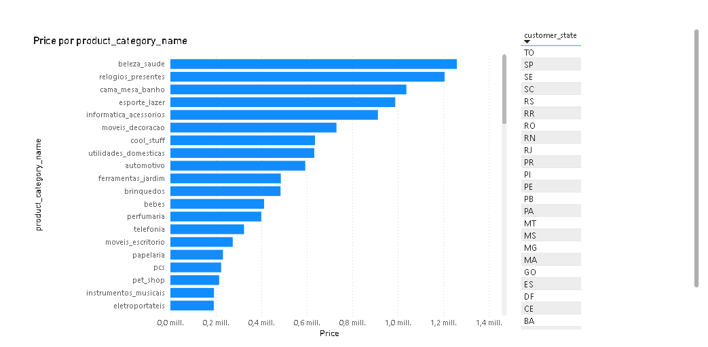
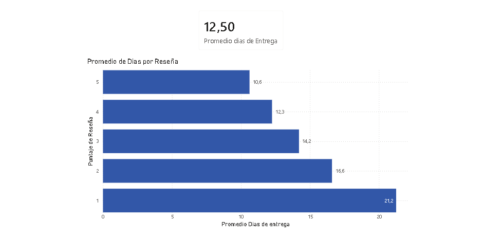
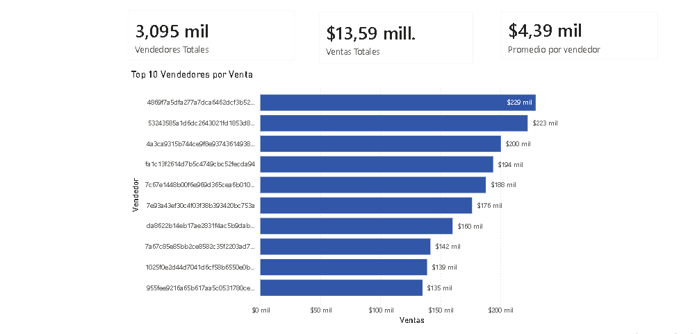
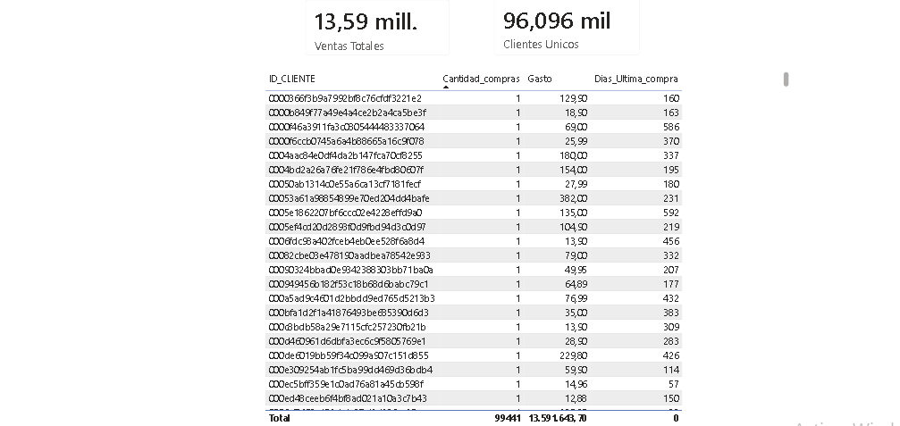

# Análisis de Datos E-commerce (Olist) — SQL + Power BI

Análisis completo sobre el dataset público de **Olist** (marketplace de e-commerce brasileño), con más de **100.000 pedidos** distribuidos en 9 tablas relacionadas. El objetivo fue responder 4 preguntas de negocio de punta a punta: desde el modelado de la base en PostgreSQL, pasando por las consultas SQL, hasta la visualización de resultados en dashboards de Power BI.

## Stack

- **SQL / PostgreSQL** — modelado relacional, JOINs, agregaciones, subconsultas y CTEs
- **Power BI** — dashboards interactivos conectados en vivo a PostgreSQL, medidas DAX

## Preguntas de negocio respondidas

### 1. ¿Qué categorías de producto y regiones generan más facturación?
Se sumó la facturación total agrupando por categoría de producto y estado del cliente.

**Resultado:** San Pablo (SP) domina el ranking, apareciendo en las primeras 9 combinaciones categoría+región. La categoría líder en SP es *cama_mesa_banho* (hogar/blanquería), con casi $478.000 facturados.

### 2. ¿El tiempo de entrega afecta la satisfacción del cliente?
Se cruzó la duración real de entrega de cada pedido con el puntaje de reseña dejado por el cliente.

**Resultado:** correlación inversa clara — a mayor tiempo de entrega, peor puntaje promedio.

| Review score | Promedio días de entrega |
|---|---|
| 1 ⭐ | 20.8 días |
| 2 ⭐ | 16.2 días |
| 3 ⭐ | 13.8 días |
| 4 ⭐ | 11.8 días |
| 5 ⭐ | 10.2 días |

### 3. Performance de vendedores
Ranking de vendedores por facturación total y cantidad de ventas.

**Insight:** vendedores con facturación similar pueden tener volúmenes de venta muy distintos — algunos venden pocas unidades a precio alto, otros muchas unidades a precio bajo, con el mismo total facturado.

### 4. Segmentación de clientes (RFM)
Se calcularon las 3 métricas clásicas de segmentación por cliente, combinadas con **CTEs** en SQL y medidas **DAX** en Power BI:

- **Recency:** días desde la última compra
- **Frequency:** cantidad total de compras
- **Monetary:** gasto total acumulado

**Nota técnica:** el dataset genera un `customer_id` distinto por cada compra (aunque sea el mismo cliente). Para identificar clientes reales a través de sus compras se usó `customer_unique_id`, la columna que sí persiste entre transacciones.

## Dashboard en Power BI

El dashboard tiene 4 páginas, una por cada pregunta de negocio, conectadas en vivo a la base PostgreSQL (relaciones entre tablas y medidas DAX personalizadas).

## Archivos

- `analisis_olist.sql` — script completo: creación de tablas y las 4 consultas de negocio, comentadas.
- `imagenes_dashboard/` — capturas de las 4 páginas del dashboard de Power BI.

## Autor

Sebastián Luján — [github.com/SebalujanP](https://github.com/SebalujanP)
